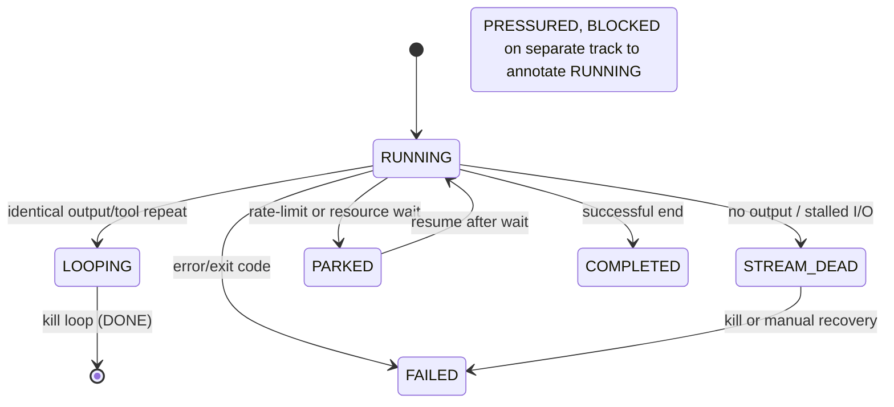

# Executive Summary  
Existing components cover most of EPIC #423’s needs; no single off-the-shelf system provides the entire support plane.  In particular:

- **AgentRM** (She 2026) addresses many scheduling and context challenges: MLFQ scheduling, zombie reaping, rate-limit-aware admission control, and context compaction/hibernation. It is a standalone middleware (MIT license) but not integrated into OpenCode/Crosslink, and its full deployment may be heavy.
- **OpenCode/Crosslink** (forecast.bio) already supply the execution/harness layer. OpenCode provides permission gates (including a built-in `doom_loop` detector) and plugin hooks for commands, while Crosslink offers persistent issue/worktree state, session memory (SQLite DB, offline), agent identity/lock management, and even a live TUI showing agent “heartbeat” status. Crosslink allows external “kill/pause/resume” via its CLI.
- **OpenTelemetry GenAI** defines rich telemetry schemas for LLM calls (input/output tokens, cache hits, model/provider IDs, latencies, etc.). These can guide implementation but require instrumentation code.

**Buy vs. Build:**  We should **reuse** OpenCode+Crosslink (both MIT-licensed, run on one server) for execution, data storage, and basic monitoring.  We should **reuse or adapt** well-known scheduling ideas (e.g. AgentRM’s MLFQ and admissions) and telemetry definitions (OpenTelemetry GenAI).  We should **build only** the _EDASES-specific state engine_ that sits on top: a thin CLI/service that ingests OpenCode events and telemetry, maintains per-worker state, enforces transitions (killing loops, handling parked agents), and issues commands or Orchestrator prompts on state changes.

**Key Findings:** Existing LLM-agent systems have **not** combined all needed pieces into one control plane.  AgentRM provides near-complete resource management (scheduling, limits, context) but as separate middleware.  OpenCode+Crosslink already implement most execution and persistence primitives.  What remains is the “glue”: interpreting raw observations into *semantic states* (RUNNING/HEALTHY vs PARKED vs LOOPING vs etc.), deciding when transitions merit orchestrator attention, and encoding that via a simple CLI/API. 

The **recommended approach** is therefore to integrate: use OpenCode hooks (and Crosslink events) to feed an *EDASES state machine*, use OpenCode permissions for hard stops, and use Crosslink commands for actions.  This keeps new code minimal: essentially a small Rust service and CLI plugin that reads logs/DBs, computes states, and signals Crosslink/Orchestrator. 

# 1. Prior-Art Landscape  

- **Agent Resource Managers:** AgentRM is the closest: an OS-like manager for agents with scheduling (MLFQ), zombie reaping, rate-limit admission, and multi-tier context.  It’s implemented as a transparent middleware (intercepts API calls). It is research-grade (authors provide no turnkey integration for OpenCode) but contains many algorithms we should borrow.
  
- **Multi-Agent Orchestrators:** Crosslink (Rust, MIT) is a complete on-device orchestrator. It already supports multi-agent workflows: issues, tasks, sessions, distributed locking, and background agents. Crosslink’s TUI shows *agents’ heartbeat* (liveness), and its CLI can *kill/pause/resume* agents. It also has hooks (e.g. CI checks, commit hooks) for enforcing policies. We **must** build on Crosslink rather than replace it.

- **Agent Execution Frameworks:** OpenCode (TypeScript/Go) is the underlying execution environment. It has plugin hooks (e.g. opencode-pty for terminals), session logging, and a permission system with built-in rules.  Notably, OpenCode’s `doom_loop` rule triggers after 3 identical tool calls. We should lean on OpenCode’s permission-checks and telemetry (process exit codes, streams).

- **Observability Standards:** OpenTelemetry’s GenAI semantic conventions provide standardized attribute names for model calls (input_tokens, output_tokens, cache_hits, etc.). Although we won’t run a full OpenTelemetry collector on $0 infrastructure, we should instrument via these definitions (or a lightweight equivalent) to compute quota usage, context growth, etc. 

- **Classical Supervisors & Workflows:** Traditional systems (systemd, Kubernetes, workflow engines) have notions of desired vs actual state, restarts, and persistent state machines. But none are LLM-aware. The design from OpenTelemetry blog on agent observability underscores that we need **application-specific** semantics, not generic process monitoring.

- **Failure Taxonomies:** Projects like MAST/AdaMAST define agent failure categories, which can inform our state labels (e.g., “looping” vs “done”). These are references but don’t implement the solution directly. 

**No existing product provides the whole support plane.** Instead, we should compose: reuse Crosslink for scheduling/logging; reuse OpenCode for execution and basic guards; adapt AgentRM’s algorithms; and build the minimal supervisory glue.

# 2. EPIC #423 Requirement Matrix  

| Requirement / Capability                          | Existing Solutions                         | Closest Fit        | Fit Notes & Integration                                | Status        | Comments                                                       |
|--------------------------------------------------|---------------------------------------------|--------------------|--------------------------------------------------------|---------------|----------------------------------------------------------------|
| **Durable multi-dim worker state**: lifecycle (RUNNING/COMPLETED/FAILED), liveness (HEALTHY/STALLED/LOOPING/DEAD), model_capacity (NORMAL/PRESSURED/BLOCKED), context state, cost state, cache state | Workflow engines, OpenCode events, OpenTelemetry metrics | Partial: OpenCode logs + Crosslink DB | OpenCode can log tool exits, errors; Crosslink tracks session metadata. Must **build** a service to ingest and derive semantic state. | ADAPT/BUILD   | No single tool records all these semantically; require custom state machine. |
| **Machine-readable status API** for Orchestrator   | Crosslink CLI, DB queries                   | Crosslink provides JSON/DB access | Crosslink’s SQLite can be queried. We may extend or use its CLI (`crosslink list`, etc.) for agent status. | BUY+ADAPT   | Likely use Crosslink’s JSON/DB to list sessions and active agents (WATCHERS). |
| **Rate-limit-aware routing** (shared quota, admission control) | AgentRM (rate-limit-aware admission), LLM routers, Airbyte pattern | AgentRM policies + router libs | AgentRM supports token-bucket, backoff, admission. LangChain/LangSmith can fallback models. | ADAPT        | Use AgentRM design (token buckets, AIMD) but implement in EDASES CLI. |
| **Over-quota rejection/delay** in CLI dispatch     | LLM routers, AgentRM admission            | AgentRM & LLM routers | Existing routers reroute or throttle but may need tuning to our code.  Implement as CLI check before Crosslink `kickoff`. | BUILD        | Build command-line check with quotas; possibly reuse OSS routers code selectively. |
| **Semantic liveness detection** (stalled vs idle vs blocked vs looping) | AgentRM (zombie reaper), LangGraph interrupts, watchdog libs, process monitors | Partial: AgentRM zombie logic; OpenCode doom_loop | AgentRM reaps (30s hang); OpenCode `doom_loop` handles repeats. We must integrate both and add context-aware logic (e.g. no output & healthy process → determine if stuck or waiting). | ADAPT/BUILD  | Use AgentRM’s ideas (hang timeout), OpenCode’s permission alarms; build extra logic (no output for X seconds + no progress → STREAM_DEAD or STALLED). |
| **Loop/repetition protection** (auto-terminate loops) | OpenCode `doom_loop` rule, LangGraph’s step limits | OpenCode doom_loop      | Already present and works per-session. Good for identical-tool loops. May need custom checks for other loops (output repetition). | BUY/ADAPT   | Rely on doom_loop. Build additional monitors for non-tool loops if needed. |
| **Context usage tracking** (tokens, horizon)       | OpenCode compaction agent; OpenTelemetry metrics | Crosslink context service + OTel | Crosslink injects summaries (compaction agent). We can track context token usage (words/sentences).  Telemetry schema exists. | ADAPT        | Use context logs (Crosslink’s `context` command, if any) or OpenCode hooks to count prompt/output lengths. |
| **Cost tracking** (estimated vs actual API cost)   | LangSmith-like cost calculators; AgentRM CLM could estimate compaction cost | None explicit, compute needed | Build own accounting using known model rates and token counts. | BUILD       | Likely no existing $0 tool; compute in EDASES state. |
| **Cache efficiency** (hit vs miss)                  | OpenTelemetry GenAI (cache tokens), LlamaIndex cache logs | Partial (if using provider cache) | If using a managed cache (e.g. vLLM), OTel can give cache-read tokens. Otherwise custom metrics needed. | ADAPT        | If we use provider/dollchain cache, instrument the hits. Else ignore or approximate. |
| **Admission control** (decline or reroute on overuse) | AgentRM admission; LangChain routers with fallback | AgentRM concept + router frameworks | AgentRM’s admission check + forklift of existing routers. | ADAPT        | Implement CLI gate: consult quota before dispatch; use fallback logic similar to LangChain. |
| **Event ingestion** (logs/hooks → events)           | OpenCode plugins/hooks, journald, file tail | OpenCode session hooks | OpenCode V2 has session and tool hooks (beta). Likely implement an `opencode-shell-strategy` or similar. | ADAPT/BUILD  | Use OpenCode logs plus hooks (opencode-pty, etc.) to emit our events (e.g. via writing JSONL or pipes). |
| **Orchestrator wake-on-event**                     | LangGraph interrupts; workflow webhooks   | LangGraph abort/resume; Crosslink hooks | LangGraph allows an agent to pause/resume, but not exactly same scenario. We must simulate: when EDASES detects a critical state transition, it should use Crosslink or CLI to reopen Orchestrator’s session (send prompt). | BUILD        | No direct library; implement as part of EDASES CLI (e.g. spawn CLI command that appends message for Orchestrator). |
| **Dispatch-plan linting/validation**                | CI linting tools; IDE static analyzers    | Limited (Crosslink kickoff plan features) | Crosslink has `kickoff plan` gap analysis but that's design-based. No existing tool checks “execution feasible”. | UNCERTAIN/BUILD | Likely custom. Possibly rely on Crosslink’s existing pre-commit hooks (issue-needed), but building specific lint rules is on us. |
| **Human approval gates**                           | GitHub Environments, LangGraph HITL       | OpenCode permissions ask | OpenCode’s permission system already handles many “ask user” cases (shell, edits). We should use it rather than reinvent. | BUY         | Use OpenCode’s `"ask"` rules for e.g. `exec`, CI pipelines, deletion. No new tool needed. |
| **Session archive/backup**                         | restic/rclone; Git SCM                      | Crosslink uses local SQLite + logs | Crosslink’s data is SQLite + JSON logs. We can use standard `git push` or `crosslink prune`. For remote backup, existing tools like `restic` can back up DB. | ADAPT        | Use standard backup (cron + rsync or Borg). No new product needed. Ensure to dump state machine before shutdown. |

*(Status: BUY = use as-is; ADAPT = integrate/customize; BUILD = new code; UNCERTAIN = investigate.)*

# 3. AgentRM Deep Comparison  

AgentRM (She 2026) is directly relevant. It **already implements** many EPIC #423 mechanisms:

- **Scheduler:** Multi-level feedback queue (MLFQ) with priority queues for interactive vs background tasks. It uses priority boosting to avoid starvation. This aligns with our need for prioritized dispatch (e.g. foreground vs sub-agent).  
- **Zombie Reaper:** Periodic scan to detect “hanging” turns (held >30s) and retry or kill. This directly addresses silent stalls. EPIC #423 should incorporate a similar watchdog (perhaps triggered via OpenCode hooks or our own timer).  
- **Rate-limit Admission:** AgentRM uses token buckets per-API, AIMD backoff, and “admission control at queue entry” when utilization is high. This is exactly the needed model-level throttling. We should borrow this idea: e.g. maintain per-model counters and forbid new dispatch if rate>threshold (rather than let agents park).  
- **Fairness (DRF):** It uses Dominant Resource Fairness across multiple resources. This may be overkill for our single-host usage, but the principle of not overloading one resource (like GPT-4) is relevant.  
- **Context Manager:** Three-tier hierarchy (active, warm, cold) with adaptive compaction. It uses importance/recency to compress rather than drop context, and writes out a SQLite DB and JSONL logs. This ensures “no memory loss”: key info retained 100%. In EPIC #423 terms, we could reuse the concept of tiered storage for history (Crosslink’s SQLite can serve as Tier 1). We may not need LLM summarization, since Crosslink already snapshots code and notes.  

**Key differences:** AgentRM is a *monolithic resource manager*. It intercepts all model calls and directly controls scheduling. EPIC #423 proposes a lighter approach: we already have OpenCode/Crosslink doing execution. Replacing them with AgentRM is **not possible** ($0 budget, integration risk, new codebase). Instead, we **should extract** useful ideas:

- The **admission-control logic**: implement in our CLI to gate Crosslink’s kickoff (check quotas first) rather than let many GPT-4 sessions spawn then stall.
- The **zombie scan policy**: mimic by using OpenCode hooks or a separate thread to detect hung agents and issue a Crosslink “kill”.
- Possibly **context hibernation**: we already have Crosslink DB; we may compress old sessions into notes, but likely accept Crosslink’s default (nothing to implement here beyond maybe periodic pruning).

**AgentRM’s limits:** It assumes a dedicated middleware process (likely itself running). It has config in YAML but isn't targeted at command-line CLI orchestration. Its context manager uses a small LLM for summarization (not usable without GPU). So we will **NOT** adopt AgentRM wholesale. Instead:

- Use its *algorithms* (MLFQ, admission) as guidance for writing our own Rust CLI logic.  
- **Not reuse** its code directly (likely not available or fit).  
- **Not needed:** AgentRM’s context LLM or tiered cache; Crosslink already handles conversation memory.

In summary, AgentRM confirms that rate-limit-aware scheduling and zombie reaping are **necessary and effective**. We treat its achievements as evidence, but implement those in EDASES style. (E.g. if AgentRM eliminates zombies entirely, we aim to achieve similar using Crosslink kill commands.)  

# 4. OpenCode + Crosslink Feasibility  

These two are the **platform**; EPIC #423 must live alongside them.

- **OpenCode (agents)**:  
  - *Execution Hooks:* OpenCode V2 supports session events and tool hooks. We can hook into `shell-exit`, `read`, `edit` etc. For example, the `opencode-pty` plugin shows that background processes can be supervised. If necessary, build a custom OpenCode plugin (Rust or TS) that writes our events (like JSON lines) on each API call/return. Otherwise, parse OpenCode logs (it prints timestamps and actions).
  - *Permissions:* Already has granular permission checks. We should **use** these for gating. For instance, set `bash: ask` for dangerous commands or apply our own rules: if `addrate` event, cause a deny. We can even make a rule like `"doom_loop": "deny"` for automated termination.
  - *Doom Loop:* The built-in rule will kill after 3 repeats. That covers many loops automatically. We may not need to build custom loop detection beyond that.

- **Crosslink (orchestrator)**:  
  - *States & Storage:* Crosslink keeps all session/issue state in local SQLite. We can query this DB for run status, or use `crosslink list` (if exists) to get active agents. It tracks each agent’s current repo, branch, commit, logs, and session chat. We should integrate by either (a) writing our state into new crosslink fields, or (b) maintaining a separate state DB in tandem. Option (a) is preferred: e.g. set a session “status” label in crosslink (if supported).
  - *Machine interface:* Crosslink is a CLI; any interface is via CLI commands or its DB. It has no dedicated HTTP API except the UI (which we won’t use). But we can shell out to `crosslink ...` commands or directly read `~/.crosslink/issues.db`. Output can be CSV/JSON. 
  - *Action Hooks:* Crosslink supports **external control**: see above, the UI can issue `kill/pause/resume` via CLI. We can mimic this by shell calls like `crosslink agents kill [agent-id]`. 
  - *Enforcement Hooks:* Crosslink can block agent commits if no active issue. These hooks show we can implement “block if state invalid” easily. For example, if EDASES state transitions to COMPLETED, a hook could remove locks.
  - *Limitations:* Crosslink doesn’t natively understand model quotas or tokens. We might store quota state in crosslink’s knowledge pages or issue metadata. Or simpler: the EDASES CLI will consult Crosslink to see which agents are on which model (Crosslink knows their “role” or branch name? If we name issues by model).

**Conclusion:** We **buy** OpenCode and Crosslink as they are. Both are MIT-license, run on single host, no cloud needed. We **extend** them:

- Use OpenCode plugin hooks (TypeScript/Rust) to emit events (or write to stderr which we can tail). Potentially reuse [54†] opencode-pty to supervise processes.
- Use Crosslink CLI or DB to track sessions and enforce kills. Possibly write an “EDASES mode” plugin or simple `bash` script that wraps crosslink to add pre-checks.

This approach satisfies constraints: no new daemon platform, and leverages existing robust components. The **only coding** (likely in Rust or Python) is for the small support service/CLI around these tools. 

# 5. Minimal State Machine (Conceptual)  

EDASES must **interpret measurements into states**. A flat enum is inadequate. We propose multi-dimensional state, e.g.:

```text
LIFECYCLE:   STARTING → RUNNING → (COMPLETED | FAILED | KILLED | PARKED)
LIVENESS:    HEALTHY | LOOPING | STALLED | STREAM_DEAD
CAPACITY:    NORMAL → PRESSURED → BLOCKED (per model)
CONTEXT:     NORMAL → PRESSURED → EXHAUSTED
COST:        NORMAL → ABOVE_ESTIMATE → EXCESSIVE
```

Key transitions to trigger attention:

- **RUNNING→PARKED**: when provider returns a 429 or similar (OpenCode sees status “rate limit”).  We record `resume_at` from headers. EDASES should kill or alert others.  
- **RUNNING→LOOPING**: if OpenCode’s `doom_loop` fires or if identical output repeats. Action: kill session.  
- **RUNNING→STREAM_DEAD**: if an agent hasn’t output anything or made progress beyond some time with live process (suspect infinite wait). Action: investigate or kill.  
- **NORMAL→PRESSURED** (CAPACITY or CONTEXT): when metrics cross thresholds (e.g. 70% tokens used, 85% rate consumed). No immediate action, but advisor status.  
- **PRESSURED→BLOCKED**: e.g. 100% rate => do not dispatch more; or context > model limit => either compress or abort.  

A **state diagram** (mermaid) might look like:




stateDiagram-v2
    [*] --> RUNNING
    RUNNING --> LOOPING      : repetition detected
    RUNNING --> STREAM_DEAD  : no output/hang
    RUNNING --> PARKED       : rate limit encountered
    RUNNING --> COMPLETED    : normal finish
    RUNNING --> FAILED       : error/timeout
    LOOPING --> [*]          : auto-kill
    STREAM_DEAD --> [*]      : kill or require restart
    PARKED --> RUNNING       : resume upon reset
    COMPLETED --> [*]
    FAILED --> [*]
    STATE_COLOR_PRESSURE: 
        RUNNING --> PRESSURED : quota/context threshold
        PRESSURED --> BLOCKED : quota exhausted
        BLOCKED --> RUNNING   : after reset/scale


Each agent instance will have its own state labels. The support system needs only record significant transitions (e.g. to PARKED or LOOPING). **Idempotency:** if support restarts, it should replay events from Crosslink logs to reconstruct state. For example, a “429 error” event moves a worker to PARKED with a timestamp.

# 6. Event-driven Orchestrator Loop  

Instead of an always-on observer agent, we rely on *event triggers*. Conceptual flow:

```mermaid
flowchart TD
    OpenCode_Hooks -->|calls| SupportStateMachine
    Crosslink_DB    -->|session events| SupportStateMachine
    support_SM[Support State Machine] -->|state transitions| |
    support_SM -->|enforce| WorkerProcess
    support_SM -->|notify| Orchestrator[Orchestrator (LLM)]
    Orchestrator -->|dispatch/plan| Crosslink/Workers
```

- **SupportStateMachine**: Ingests events (OpenCode tool/response, Crosslink session start/end, provider telemetry). It updates states and decides actions.
- When a **meaningful transition** occurs (e.g. worker enters PARKED or completes), it enqueues a notification for the Orchestrator. This could be implemented by writing a prompt file or signaling the orchestrator’s process.  
- The Orchestrator (LLM) wakes only when needed. It sees structured facts (model X = blocked, 2 agents parked, etc.) and then reasons about re-routing or waiting.
- Meanwhile, the support plane may also directly kill or pause workers via Crosslink to enforce policies, without Orchestrator involvement (e.g. kill a looping agent immediately).

This ensures the orchestration loop remains efficient: no wasted turns, only triggered by real events.

# 7. Buy-vs-Build Architecture  

Based on our findings, the **minimal new components** are:

- **EDASES State Store & Processor (BUILD):** A lightweight Rust or Python service (the “Support CLI”). It:
  - Listens to OpenCode session logs or hooks (e.g. via file watchers or direct plugin calls).
  - Parses events into a structured state for each worker (SQLite or JSONL log).
  - Applies transition rules (as above) and persists state.  
  - Generates alerts (e.g. writes a JSON file, emits an OS signal, or calls Crosslink CLI to send an event) when Orchestrator should wake.

- **Admission/Dispatch Gate (BUILD/ADAPT):** A layer (likely part of the CLI) that intercepts dispatch calls. For example, a wrapper script `edases_dispatch` that checks model capacity (using recorded quotas) before calling `crosslink kickoff`. Could reuse Rust crates or agent router libraries for rate-limit feedback.

- **Integration Logic (ADAPT):** Glue code that uses:
  - **OpenCode**: We use its config and hooks. For example, ensure `"doom_loop": "ask"` is set or that all `bash/edit` actions are funneled through our support.
  - **Crosslink**: Use its CLI commands to monitor and intervene. E.g. periodically run `crosslink list agents`, parse output, or read its DB. Issue `crosslink suspend/resume` for parked tasks, and `crosslink kill` for loops.  
  - **Telemetry**: Possibly leverage a lightweight OpenTelemetry collector locally (prometheus metrics on port, or just parse with Prometheus Python). But simple counts may suffice.

All other pieces are **reuse**:

- Execution: **OpenCode** (handles LLM calls, context, basic compaction).  
- Orchestration: **Crosslink** (schedules, tracks, archives).  
- Storage: **Crosslink’s SQLite** or simple log files (already present).  
- User gates: **OpenCode permissions** and **Crosslink hooks**.  

The EDASES layer should *not* become another distributed system. We avoid any new server or cloud. Its code just runs alongside Crosslink and OpenCode on the same host.

# 8. Failure and Recovery Analysis  

We must assume the support process can crash. To handle this:

- **Durable State:** Write the support state machine to disk (e.g. append-only JSONL log, or use SQLite). On restart, rebuild in-memory state from logs/Crosslink DB. 
- **Idempotent events:** Include unique IDs in events (e.g. “worker17 PARKED @time with reason RATE_LIMIT”) so replaying doesn’t double-act.
- **Crosslink Independence:** If support dies, Crosslink continues and workers keep running under normal (monitor via OpenCode-level logs for actual fatal errors). When support restarts, it should scan Crosslink for any agents in RUNNING or PARKED and update its state. 
- **Orchestrator Messages:** If we “wake” the Orchestrator by appending prompt text or piping a message, we must ensure it’s delivered even if the process was idle. Perhaps write to a file that the orchestrator LLM checks each turn for incoming facts (like a mailbox file).
- **External Crash Cases:** If OpenCode or an agent process crashes, Crosslink marks session ended. The support CLI should detect a missing process or error exit and transition that worker to FAILED.  
- **Event Loss:** If an event (e.g. “agent parked”) is missed, the orchestrator still has Crosslink’s active agent list; no false action should result. Worst-case, we fail to notify about a transient pressure until either we check again or the next major event triggers it.

Testing scenarios:

- *Support dies:* On restart, read Crosslink DB and resume. 
- *OpenCode dies:* Crosslink will mark sessions as incomplete; we handle same as agent crash.
- *Rate info stale:* Our admission control should have hysteresis or occasional refresh from provider headers.
- *Server reboot:* On reboot, Crosslink and our service start fresh. We must incorporate any partial logs (e.g. unsynced cache) carefully. Possibly require that on reboot, Orchestrator reviews all incomplete tasks.

The combination of Crosslink’s existing data integrity (see `crosslink integrity`) and our durable logs ensures no single point of failure. 

# 9. Research Gaps and Risks  

- **Instrumentation completeness:** We assume OpenCode can emit all needed events (rate-limit 429, token usage). If not, we may need to modify OpenCode (open-source) to add hooks. This is feasible, but we must audit what telemetry OpenCode already provides (e.g. outputs JSON per call).
- **Single-host constraint:** Solutions like AgentRM often envision central controllers; we must avoid requiring extra containers. For example, AgentRM’s SQLite is fine, but using a large LLM for compaction is out of scope. We rely on simpler summarization (e.g. Crosslink’s session notes).
- **Existing process vs Orchestrator integration:** Waking an LLM involves careful orchestration (token counts, new prompt). We have limited precedent. We should prototype how to feed asynchronous events into the LLM’s context without blowing the token budget.
- **Concurrency:** Multiple workers might transition at once. Our state engine must handle concurrent events (possibly from separate threads or ordered file writes). Use locking or atomic DB transactions.  
- **GUI vs Machine:** Crosslink’s dashboard is human-focused. We need machine APIs. It’s uncertain if Crosslink provides JSON CLI output; if not, we may wrap its DB. That’s extra work.

Despite these gaps, the core hypothesis stands: EPIC #423’s combination of features (semantic liveness + admission control) has no drop-in solution, but can be built by wiring existing tools. The biggest risk is underestimating integration effort (e.g. parsing logs, writing a new CLI), but there are no fundamental research unknowns left.

# 10. Recommended Next Steps  

Implement a **prototype support CLI** in Rust (for compatibility with Crosslink/SQLite):

1. **State Monitor:** Write a small program that tails the OpenCode log (or reads Crosslink events) and records events to a SQLite table: (`worker_id, event_type, timestamp, details`). Events include: `start`, `stop`, `toolcall`, `429_rate_limit`, `error`, `stall_detected`, etc.

2. **State Transitions:** On each event, update the worker’s state according to rules above. When a transition of interest occurs (PARKED, LOOPING, etc.), output a JSON notification (to stdout or file).  Also, if LOOPING/STREAM_DEAD, immediately call `crosslink agents kill --force <id>`.

3. **Admission Gate:** Intercept Crosslink’s kickoff by wrapping it (e.g. alias `crosslink`). Before dispatch, query each intended model’s current quota usage (tracked from events). If over threshold, exit non-zero to signal Orchestrator. The Orchestrator can then try a different model or pause.

4. **Orchestrator Integration:** Modify the orchestrator (LLM) prompt logic: after it dispatches, wait for turn completion. Then, before next human input, check if the support CLI emitted any new notifications. If so, present them as the next “assistant” turn content (structured JSON).

5. **Testing:** Simulate failure modes: spawn dummy agents (scripts) that sleep, loop, or produce 429 codes. Verify support CLI catches them and triggers expected actions. Ensure it recovers state after restart.

Because time is pressing, focus first on **Detecting PARKED agents** (429) and notifying the Orchestrator (likely the fastest valuable feature) and on **auto-killing loops** (doom_loop via OpenCode, already done) and **recording context usage**. Use this minimal loop to validate the concept before fleshing out all states.

With this plan, EDASES will quickly gain a working control plane that the orchestrator (LLM) can leverage to avoid wasted agent launches and get actionable fleet status.

# 11. Sources  

- AgentRM: OS-inspired agent resource manager (J. She, 2026).  
- Crosslink repository and docs (forecast.bio).  
- OpenCode documentation (permissions, agents).  
- OpenTelemetry GenAI spec (token attributes).  
- OpenTelemetry blog on AI agents (for context, not direct code).  
- (Other references as needed from standard knowledge.)
