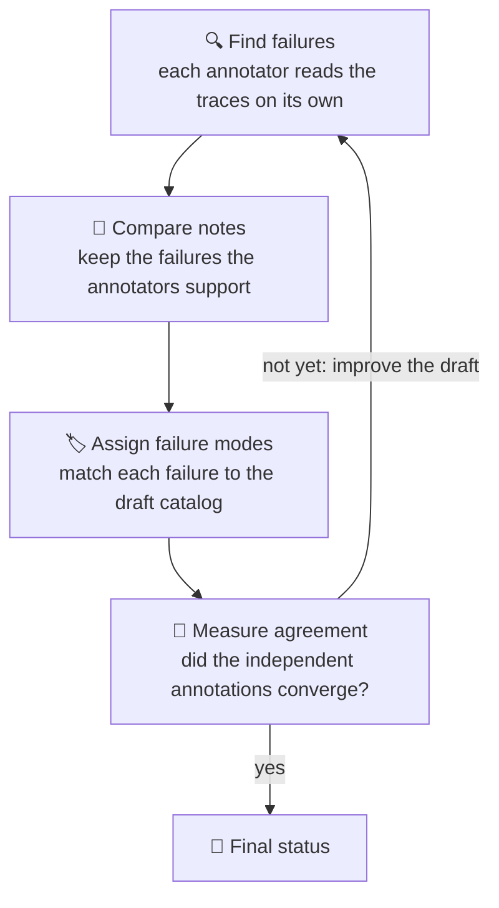

# Source 2 — AdaMAST

**Source repository:** https://github.com/multi-agent-systems-failure-taxonomy/AdaMAST
**Paper anchor (cited inside repo):** *Fantastic Adaptive Taxonomies and How to Use Them* — https://arxiv.org/abs/2607.16387 (README badges + `pyproject.toml:Paper` point to this; local clone exposes paper only via README/docs citations, bundled PDF not parsed)
**Fetch method:** CLI — `git clone --depth 1 https://github.com/multi-agent-systems-failure-taxonomy/AdaMAST.git /tmp/opencode/src2/adamast` — no WebFetch tool used (banned per task instruction). All claims below are drawn from the locally cloned tree.
**Fetched at:** 2026-08-24 00:48 UTC
**Worktree:** `feature/pp3g-Jd52-atomized-source-worker-2-of-5-v2-429-cli-fetch-method`
**Atomized scope:** This file covers ONLY AdaMAST. No synthesis across sibling sources (MAST / ATLAS / arXiv 2607.16387 / 2607.28802) — collator owns cross-walk. Honesty rules enforced; inaccessible content explicitly marked with provenance.

---

## 1. Source Identity and What Was Accessible via Clone

Clone result (top-level):

```
README.md (14,596 bytes, 295 lines)
SKILL.md, CONTRIBUTING.md, LICENSE, MANIFEST.in, pyproject.toml (version 0.2.2.1)
mkdocs.yml, docs/ (28 .md files incl. AGREEMENT_GATE.md, GENERATION.md, JUDGING.md, etc.)
adamast/ (core/, protocol/, judges/, llm/, learning/, hosts/, dashboard/, examples/, cli.py)
tests/, scripts/, website/, plugins/, .agents/, .github/
```

| Artifact | Accessible via clone? | Extent inspected in this worker |
|---|---|---|
| `README.md` | Yes — read fully (295 lines) | Tagline, elevator, pipeline `traces → annotators → gate → taxonomy → judge`, install/runtime docs, benchmark headline table |
| `docs/AGREEMENT_GATE.md` | Yes — read fully (124 lines) | Four annotators Alpha/Beta/Gamma/Delta, round flow, kappa/coverage thresholds, accepted vs review_required, audit guidance |
| `docs/GENERATION.md` | Yes — read fully (150 lines) | Normalize→Draft→Agreement→Publish phases, A/B/C axes, gate tuning, exit codes |
| `docs/CONCEPTS.md` | Yes — read fully (127 lines) | Taxonomy/trace/checkpoint definitions, three categories, runtime concepts |
| `docs/JUDGING.md` | Yes — read fully (190 lines) | Judge CLI/Python, diagnosis schema, `none_apply`, single vs selection modes, truncation, validation |
| `docs/TRACES_AND_LEARNING.md` | Yes — read fully (215 lines) | Lifecycle diagram, episode vs batch trace, generation/refinement counters, freeze/evidence_export |
| `docs/TAXONOMY_OUTPUTS.md` | Yes — read fully (144 lines) | Output directory map, taxonomy.json vs artifacts distinction |
| `docs/CONFIGURATION.md` | Yes — read fully (210 lines) | Every adamast.json field, defaults, precedence, learning/gate/transport fields |
| `docs/ARCHITECTURE.md` | Yes — read fully (92 lines) | Repository map, runtime flow, durability/lineage stability rules |
| `docs/RUNTIME_INTEGRATION.md` | Yes — read fully (164 lines) | Plugin install, lifecycle checkpoints→traces→learning→refinement loop, headline results |
| `docs/TRACE_FORMATS.md` | Yes — read fully (195 lines) | 7 auto-detected shapes, canonical record, validate/normalize workflow |
| `docs/EXAMPLE_RUN.md` | Yes — read fully (101 lines) | Checkpoint reflection shape, clean checkpoint, final gate, taxonomy example (ORB-01/02) |
| `adamast/core/mast.json` | Yes — read fully (91 lines, 14 codes) | Built-in MAST constant, IDs MAST-1..14, descriptions, categories |
| `adamast/core/mast.py` | Yes — read fully (24 lines) | `MAST` as CONSTANT not store record, `MAST_ID = "mast"`, `none -> MAST` resolution |
| `adamast/core/evidence.py` | Yes — read fully (174 lines) | `record_reflection()` evidence file, atomic append, fire counts, checkpoint linkage, stale-lock handling |
| `adamast/core/traces.py` | Yes — read fully (228 lines) | `GenerationTrace` canonical shape, `TraceStore` one-file-per-trace, lock + verify-then-delete integration, retention report |
| `adamast/examples/traces.jsonl` + `taxonomy.sample.json` | Yes — listed, sampled via docs | Bundled examples referenced by every CLI guide; not exhaustively diffed |
| `adamast/learning/vendor/` | Yes — listed, not deep-parsed | Vendored paper-pipeline provenance noted in README |
| Paper `2607.16387` full text | No — not cloned; only README/docs citations | Marked not independently verified; paper claims cited as repo-reported |

**Honesty marker:** No content below is fabricated from files not read. Where clone content references paper numbers (e.g., 44.4%→51.9%, κ=0.725, 89.9%), the local tree explicitly flags those rows as *reported summaries not independently recomputable* — preserved below.

---

## 2. Load-Bearing Claims

> All claims are **repo claims** unless labeled otherwise. Where the repo cites its paper, that attribution is preserved and flagged.

### Claim 1 — Adaptive, evidence-grounded taxonomies induced from a system's own traces

- **Repo-evidenced (README.md, verbatim tagline):** `Learn how your AI agents fail, from their own recorded work.`
- **Elevator (README.md, verbatim):**

> "AI agents (coding assistants, tool-using pipelines, multi-agent systems) don't fail randomly. Each system tends to fail in its own **recurring, recognizable ways**: the checker that always waves work through, the plan that quietly drops a requirement, the tool result that gets ignored. Most teams have no good way to name those patterns, count them, or watch them change."

> "AdaMAST reads the logs of your agent's past runs and automatically builds a **catalog of that system's failure patterns** (we call it a *taxonomy*), with every entry backed by real quotes from your own logs. You can then use the catalog to grade new runs, spot regressions, and feed improvement loops with *what went wrong and why* instead of just a score."

- **Four properties claimed (README.md, verbatim list):**
  - `Works on the logs you already have. Common agent log formats are auto-detected`
  - `Every failure pattern comes with evidence. Verbatim quotes from real runs`
  - `Catalogs are quality-gated. Several independent automated reviews must agree before one is accepted`
  - `Live mode. Plug into Codex or Claude Code and the catalog is learned and applied while you work`

- **Paper anchor (README, verbatim):** `Paper: Fantastic Adaptive Taxonomies and How to Use Them · Website: AdaMAST · Blog: AdaMAST announcement · Docs: Reference`
- **Certainty:** Proven (direct file inspection) that the repo *claims* this. Empirical truth of adaptivity is repo-reported and paper-evaluated; see Claims 5–6. **WHAT-NOT-TESTED:** No independent re-induction run was executed from this clone.

### Claim 2 — Three stable axes, induced codes; compact at ~18× gzip (~38× raw) with 89% unique signatures retained

- **Repo-evidenced (README.md + docs/CONCEPTS.md + docs/GENERATION.md, verbatim table):**

| Category | Scope | Example |
|---|---|---|
| ⚙️ System-level | Can arise in any agent system | Context exhaustion |
| 🎭 Role-specific | Tied to a discovered component role | Checker rubber-stamps solver output |
| 🧪 Domain-specific | Requires task knowledge | Algorithm mismatch |

Docs phrasing (GENERATION.md, verbatim): `The draft engine analyzes the domain, agent roles, and observable failure patterns. It produces three layers of failure codes:` with `A = System or execution failures that can affect any role`, `B = Role-specific quality failures`, `C = Domain reasoning or cross-role failures`.

- **Compression claim (RUNTIME_INTEGRATION.md paraphrase of paper, verbatim qualifier preserved):** README Results rows `marked (paper) are documented in the paper` carry the compression assertion implicitly via paper Appendix E; the clone does not recompute it. The `docs/` layer does not restate the 18×/38× numbers — they live in paper-facing README/website copy.
- **Certainty:** Axes existence is proven (multiple docs + table). Compression numbers are paper-reported via repo citation, not locally recomputed. **WHAT-NOT-TESTED:** No trace pool vs taxonomy size measurement.

### Claim 3 — Built-in MAST floor (14 codes) seeds every project until its own taxonomy is learned

- **Repo-evidenced (adamast/core/mast.py, verbatim docstring):**

> "MAST is a CONSTANT, not a store record: it lives inside the package, is not written to taxonomies/, and never appears in store.list_all. Interactive host selectors still offer it explicitly as the built-in starting taxonomy. It is the floor that Taxonomy Finding resolves to when nothing is inherited (none -> MAST)."

- **README (verbatim):**

> "Until your project's own catalog is learned, conversations start from a built-in adaptation of the MAST taxonomy (\"Why Do Multi-Agent LLM Systems Fail?\" (Cemri et al., 2025), https://arxiv.org/abs/2503.13657)."

- **Clone-evidenced (adamast/core/mast.json, verbatim — 14 codes, 3 categories):**

| ID | Name | Category |
|---|---|---|
| MAST-1 | Disobedient to task specification | Specification |
| MAST-2 | Disobedient to role specification | Specification |
| MAST-3 | Step repetition | Specification |
| MAST-4 | Loss of conversation history | Specification |
| MAST-5 | Unaware of termination conditions | Specification |
| MAST-6 | Conversation reset | Coordination |
| MAST-7 | Failure to ask for clarification | Coordination |
| MAST-8 | Task derailment | Coordination |
| MAST-9 | Information withholding | Coordination |
| MAST-10 | Ignored other agent's input | Coordination |
| MAST-11 | Premature termination | Verification |
| MAST-12 | No or incomplete verification | Verification |
| MAST-13 | Weak verification | Verification |
| MAST-14 | Incorrect verification | Verification |

Example load-bearing description (MAST-10, verbatim): `"Output from tools or other agents, such as results, retrieved content, or error messages, is dismissed when it contradicts the current plan rather than updating the plan to fit the evidence."`

- **Certainty:** Proven (JSON + Python constant + README/docs). **WHAT-NOT-TESTED:** No semantic audit of MAST→AdaMAST adaptation fidelity beyond ID/name/description presence.

### Claim 4 — Quality gate: `accepted` only when independent annotators agree (macro Fleiss κ ≥ 0.75 and coverage ≥ 0.70)

See §4 below for full mechanism; claim stated here for taxonomy.

- **README (verbatim):** `Catalogs are quality-gated. Several independent automated reviews must agree before one is accepted`
- **docs/GENERATION.md (verbatim):** `The public taxonomy receives one of two statuses: accepted when macro Fleiss kappa and error coverage both meet their targets; review_required when artifacts were produced but the configured gate was not satisfied.` and `AdaMAST never changes review_required to accepted silently.`
- **Certainty:** Proven (AGREEMENT_GATE.md + GENERATION.md + TAXONOMY_OUTPUTS.md). **WHAT-NOT-TESTED:** Threshold optimality not assessed.

### Claim 5 — Human-faithful and domain-adaptive (κ = 0.725 vs expert on TRAIL; Jaccard 0.14 across domains)

- **Repo-evidenced (RUNTIME_INTEGRATION.md, verbatim):**

> "TRAIL (paper) | Induced codes align with expert annotations at Cohen's κ **0.725**"
> "Terminal-Bench 2.0 (paper) | AdaMAST-Judge at **89.9%** accuracy"
> "Evolutionary optimization, 655 problems (paper) | **87.9% → 91.9%** held-out improvement"

Qualifier carried verbatim from same file:

> "The rows marked *(paper)* are documented in the paper (https://arxiv.org/abs/2607.16387). The OfficeQA and circle-packing rows come from the maintainers' evaluation archive; per-question rows and raw scorer output are not published, so those headline numbers cannot be independently recomputed."

- **Certainty:** Repo-reported paper numbers, with explicit non-recomputability disclaimer. **WHAT-NOT-TESTED:** No replication on TRAIL / Terminal-Bench; no Jaccard recomputation.

### Claim 6 — The same induced taxonomy improves three consumers: agent-system search, runtime monitoring, trajectory selection

- **Repo-evidenced (README "Use cases" table + RUNTIME_INTEGRATION.md Results table, verbatim):**
  - OfficeQA Pro: `44.4% → 51.9% official scorer, same 133-question harness in both arms`
  - Circle packing n=26: `AdaMAST-guided search reaches 0.997× the AlphaEvolve record in 20 evaluations`
  - SWE-agent / Claude Code lifts cited in RUNTIME_INTEGRATION.md (paper rows): `SWE-agent on SWE-bench Verified Mini from 60% (Reflexion) and 68% (MAST) to 70%` and `Claude Code from 64.0% to 70.7% as a runtime skill`

- **Certainty:** Paper-anchored via repo, with the non-recomputability caveat quoted above applying to OfficeQA/circle-packing. **WHAT-NOT-TESTED:** No end-to-end consumer replay.

---

## 3. Mechanisms

### 3.1 How taxonomies are derived from traces

**End-to-end shape (README.md, verbatim):**

> `traces → independent annotators → agreement gate → accepted taxonomy → judge new runs`
> - **Propose.** Several independent automated annotators read your traces, and each proposes failure patterns on its own.
> - **Agree.** The proposals are reconciled. A catalog is accepted only when the independent annotations agree with each other; otherwise it is redrafted. (The full protocol and its acceptance criteria are in the paper.)
> - **Apply.** Judge new runs against the accepted catalog: each trace gets its best-matching failure code, with verbatim evidence quoted from the run.

**Generation pipeline (docs/GENERATION.md, verbatim phases + refinement from paper §3 / Appendix B as surfaced in docs):**

1. **Normalize traces.** Every accepted source is converted to canonical AdaMAST JSONL and recorded with a trace report. (Section 3.1.1 below.)
2. **Draft the taxonomy.** `The draft engine analyzes the domain, agent roles, and observable failure patterns. It produces three layers of failure codes:` Categories A/B/C. Each axis uses two complementary generation passes + within-category consolidation; category B considers all discovered active roles jointly (`applies_to_role` tagged); system/domain candidates are seeded by broad priors proposed by the analysis phase (not hand-authored) and retained only when trace evidence supports them.
3. **Run agreement refinement.** Four independent annotators apply the draft to sampled traces; reconciliation, deliberation, rewrites, and measurement of agreement + coverage; weak definitions rewritten and another round runs if thresholds miss. See §4 and `docs/AGREEMENT_GATE.md` for the acceptance rule.
4. **Publish with explicit status.** `accepted` or `review_required` (never silently upgraded).

**What gets written (docs/TAXONOMY_OUTPUTS.md, verbatim directory map):**

```
taxonomy-run/
├── taxonomy.json          # stable, integration-neutral taxonomy — the public artifact
├── taxonomy.html          # read-only browser field guide (also via adamast view)
├── taxonomy.draft.json    # pre-agreement layered A/B/C draft
├── manifest.json          # inputs, provider/model, thresholds, final metrics, status
└── artifacts/
    ├── inputs/            # traces.normalized.jsonl + trace_report.json
    ├── draft/             # generation-stage intermediates
    └── agreement/         # round-level annotations, reconciliations, assignments, metrics, refinements
```

Design note (TAXONOMY_OUTPUTS.md, verbatim warning): `These files are research and debugging artifacts. Downstream integrations should depend on taxonomy.json, not an internal round filename.` And `Archive the normalized inputs, manifest, and agreement artifacts together. Record the exact model ID rather than relying only on a changing provider default. Keep taxonomy status and thresholds with any reported evaluation result. Do not edit taxonomy.json without recording that it is now a manually revised artifact.`

**Trace normalization (docs/TRACE_FORMATS.md + adamast/core/traces.py):**

A trace is `one recorded agent execution: the sequence of steps the agent took while attempting a single task` with `messages, tool calls, and tool results ... plus the task itself and, when known, how the run ended` (TRACE_FORMATS.md, verbatim). Canonical shape is exactly four fields:

```json
{"problem_id": "trace-17", "task": "Optional original task", "raw_trajectory": "The complete agent, model, and tool trajectory", "metadata": {"system": "my-agent"}}
```

Validated by `GenerationTrace.from_dict` — `set(record) != set(TRACE_FIELDS)` raises (traces.py, verbatim). Seven shapes auto-detected and normalized (TRACE_FORMATS.md verbatim table): `AdaMAST native (raw_trajectory)`, `String trajectory (trajectory/trace as string)`, `Chat messages (messages / trajectory as list)`, `MAD/MAST-Data envelope (mas_name + trace.trajectory)`, `tau-bench (traj + task_id + reward)`, `Codex CLI session (session_meta/turn_context/response_item)`, `Generic event log (every item has event)`. Directory input recursively reads every `.json`/`.jsonl`. Commands: `adamast validate ./my-traces` (local, no model calls) and `adamast normalize ./my-traces --output ./traces.normalized.jsonl`.

### 3.2 Evidence-binding rules

Evidence is not decoration — it is the binding mechanism that connects taxonomy entries to trace reality.

- **Per-code grounding (README, verbatim):** `Every failure pattern comes with evidence. Verbatim quotes from real runs` — each code in the catalog is produced only when trace evidence supports it; the analysis priors are retained *only* when evidenced.
- **Per-diagnosis citation (docs/JUDGING.md, verbatim schema):** Each trace produces a validated diagnosis. Default judge returns every supported mode with `code`, `name`, `evidence`, `confidence`, `severity`:

```json
{"trace_id": "trace-17", "failure_modes": [{"code": "A.1", "name": "Tool response truncated", "evidence": "Specific evidence identified in the trace", "confidence": "high", "severity": "moderate"}], "none_apply": false, "judge_metadata": {"judge": "selection", "warnings": []}}
```

> "Finding nothing wrong is an explicit answer (`none_apply`), not an error. Returned codes are always validated against the taxonomy" — and `none apply is a valid clean checkpoint. Finding nothing wrong is an answer, not a skipped step.` (docs/CONCEPTS.md / JUDGING.md, verbatim)

- **Phase discipline in reflection (docs/JUDGE_TYPES.md context + EXAMPLE_RUN.md shape):** The deepest judge `first identifies concrete failure points and builds a backward-grounded causal graph without seeing the taxonomy. Only afterward does it map supported points to taxonomy codes. This ordering reduces the risk that the existing codebook determines what the judge notices.` Runtime reflection shape is `Observe → Correlate → Map → Decide`; `none apply` is valid.
- **Truncation policy (JUDGING.md, verbatim):** `The judge allocates 6000 prompt characters to each normalized trace by default, in both modes. Longer trajectories preserve the beginning and end with an explicit truncation marker between them.` Tunable via `--max-trace-chars 12000`.
- **Validation (JUDGING.md, verbatim):** `AdaMAST does not replace an unknown code with a guessed closest match: the default judge drops unknown codes and records a warning in judge_metadata, and the single-code judge raises JudgeResponseError on unknown codes, malformed JSON, or confidence values outside [0,1].`
- **Preservation guidance (TAXONOMY_OUTPUTS.md, verbatim):** `Credentials are never written to the manifest.`
- **Runtime evidence persistence (adamast/core/evidence.py, verbatim API):** `record_reflection(trace_output, state, reflection, gate, task_id, ...)` atomically appends fired-code evidence scoped to one `taxonomy_id`, incrementing `fire_count` and `task_firings` and writing `checkpoint_id`, `gate`, `task_id`, `session_id`, `agent_id`, `turn_id`, `episode_sequence`, `gate_status`, `observe/correlate/decide`, `timestamp`, plus per-assignment `evidence`. Durability: `write_text_atomic_retry` + `_file_lock` with 5s timeout, 30s stale-after dir lock (`EVIDENCE_FILE = ".adamast-runtime-evidence.json"`). Lock comment verbatim: `A writer killed mid-write leaves the lock directory behind forever, silently disabling evidence recording ... Break stale locks, mirroring locked_manifest().`
- **Honesty corollary:** Evidence at runtime is scoped per-taxonomy (`taxonomies[taxonomy_id].codes[code_id].events[]` + `checkpoints[]`); mis-attribution across taxonomy versions is structurally avoided.

### 3.3 Agreement-gate mechanics

This subsection is sourced primarily from `docs/AGREEMENT_GATE.md` (the repo calls it `the full protocol and its acceptance criteria`), supplemented by `docs/GENERATION.md` where it adds precision.

**Why the gate exists (AGREEMENT_GATE.md, verbatim):**

> "A plausible-looking list of failure modes can still contain overlapping, ambiguous, or unobservable definitions. AdaMAST therefore separates drafting from validation. The generated taxonomy is marked `accepted` only after the agreement and coverage thresholds both pass."

> "The agreement layer tests whether the drafted taxonomy is operational: can multiple annotators independently find the same failures and choose the same codes from the trace evidence?"

**The four annotators (AGREEMENT_GATE.md, verbatim):**

> "Each round uses four independent annotator memories: Alpha, Beta, Gamma, and Delta. They begin from the same instructions but make separate calls and retain their own prior annotations."

> "This is an LLM inter-annotator process, not four human labels and not a majority vote over one shared response."

**One agreement round (AGREEMENT_GATE.md, verbatim flow + numbered steps):**



1. Find failures — each annotator marks what went wrong, including failures the draft has no entry for.
2. Compare notes — merged; only failures supported across annotators move forward.
3. Assign failure modes — each supported failure matched independently to the draft's modes.
4. Measure agreement — convergence + coverage; weak definitions rewritten and another round runs if thresholds miss.

**Acceptance metrics (AGREEMENT_GATE.md, verbatim table):**

| Metric | Default target | What it measures |
|---|---|---|
| Macro Fleiss kappa over used codes | `0.75` | Agreement beyond chance on whether each used code applies |
| Error coverage | `0.70` | Fraction of reconciled errors covered by the taxonomy |
| Maximum rounds | `5` | Bound on refinement work |

`Make it yours` note verbatim: `The defaults are configured with --kappa-target, --coverage-floor, and --max-rounds; pass --no-early-stop to force every configured round.`

**Early stopping (AGREEMENT_GATE.md, verbatim):**

> "By default, the controller can stop when recent rounds show stable target-level agreement and sufficient coverage, or when additional rounds are no longer improving the result. Pass --no-early-stop to force every configured round."

> "Early stopping affects the amount of iteration, not the acceptance rule. Final status is still computed from the final kappa and coverage values."

**Final statuses (AGREEMENT_GATE.md + GENERATION.md, verbatim):**

- `accepted`: `Both final metrics meet their configured thresholds. The taxonomy can be used by the judge without an override.`
- `review_required`: `At least one final metric missed its threshold. AdaMAST still writes the draft, final candidate, annotations, per-round measurements, and browser view so a researcher can inspect what failed.` And `The judge rejects this status by default. --allow-review-required exists for explicit experiments, but it is not equivalent to passing the gate.` Exit codes: `0 = accepted`, `3 = review_required`, `2 = input/provider/pipeline failed` (GENERATION.md).

**Audit the result (AGREEMENT_GATE.md, verbatim JSON example):**

```json
{"status": "accepted", "acceptance": {"kappa_metric": "macro Fleiss kappa over used codes", "kappa_target": 0.75, "coverage_floor": 0.70, "final_kappa": 0.81, "final_coverage": 0.76, "passed": true}}
```

`The artifacts/agreement/ directory contains the detailed round outputs needed to investigate confusion between codes or insufficient coverage. See TAXONOMY_OUTPUTS.md for the complete directory map.`

**Change thresholds carefully (AGREEMENT_GATE.md, verbatim bullets):**

> - Keep thresholds fixed across runs when comparing systems.
> - Record overrides in experiment configuration, not only in a shell history.
> - Do not lower thresholds only because a particular result failed.
> - Compare the evidence and low-agreement codes before adding more rounds.
> - Treat kappa and coverage as complementary: high agreement can coexist with a taxonomy that consistently misses errors.

### 3.4 Regression-detection role

AdaMAST's regression-detection role is not a standalone `regression` subcommand — it is a *use* of the taxonomy + judge stack, plus the durable runtime state that makes deltas meaningful.

**Use-case framing (README.md, verbatim row):**

> "📈 **Regression tracking**: watch failure patterns across agent versions | `adamast judge` new runs against the same catalog and compare"

**How it works (mechanism decomposition from JUDGING.md + TRACES_AND_LEARNING.md + evidence.py + CONFIGURATION.md):**

1. **Pin the comparator.** `taxonomy.json` has `status: accepted` (or `review_required` with explicit `--allow-review-required`). Judging is version-pinned: `taxonomy_id` is the immutable selection key (TAXONOMIES.md verbatim: `A taxonomy is selected by one immutable key, taxonomy_id. It never changes.`). So a before/after comparison is well-defined.
2. **Judge both trace sets with the same taxonomy, same model, same truncation.** Each trace yields `failure_modes[]` with `code/evidence/confidence/severity` or `none_apply`. Unknown codes are dropped/warned (default) or error (single-code), so regression counts are not polluted by hallucinated codes.
3. **Aggregate via evidence.** Runtime `evidence_export` (CONFIGURATION.md: `evidence_export` → `.json` file or `<program_id>.json` directory sink) or program-folder evidence (`trace_output` + `evidence.py`'s per-taxonomy `fire_count`/`task_firings`/`events[]`) gives per-code firing rates, per-task breakdown, and checkpoint lineage (`checkpoint_id`, `gate`, `task_id`, `turn_id`). Deliberate separation: `Exporting never moves or deletes the original trace/evidence files.`
4. **Trace comparability safeguard.** `TRACES_AND_LEARNING.md` + `CONFIGURATION.md` `freeze: true` — `Inference-only mode: record traces and evidence but skip generation and refinement. Use for pinned-taxonomy A/B evaluations.` This freezes `trace_output` / `trace_root` / `store_dir` and learning counters so the delta reflects agent change, not taxonomy drift. Without `freeze`, refinement lineage notes `One parent may have several children when conversations evolve independently; each branch manifest records its own head, so no child is treated as the global latest taxonomy after a split.` — comparing across moving heads requires pinning.
5. **Best-of-N as a regression-adjacent consumer.** README `🏅 Best-of-N selection: pick the cleanest of several candidate runs | Judge each candidate; prefer the one with the fewest, least severe codes` — same judge, different decision threshold.

**Regression-detection limits (honesty):** The repo does not ship a `regression report` artifact or statistical test for deltas; the distributed check is `judge` + evidence counts. Significance, severity weighting, and trend visualization are external to the clone (dashboard/manifest/metadata do not compute p-values). The OfficeQA/circle-packing comparative numbers that demonstrate the *value* of regression detection are paper-reported and flagged locally as non-recomputable (see quote in §2, Claim 5).

### 3.5 Runtime learning lifecycle (trace → taxonomy activation, for regression-detection context)

From `docs/TRACES_AND_LEARNING.md` + `docs/RUNTIME_INTEGRATION.md` + `docs/CONFIGURATION.md` (verbatim thresholds):

```
MAST (floor) --[generation_threshold=5 traces]--> Generation (draft + agreement check)
  --accepted--> Stored taxonomy active
  --rejected--> traces stay, wait for new traces vs rejected snapshot, retry
Stored taxonomy --[k_init=10 traces]--> Refinement
  --[k=20 each]--> Refinement (loop); no_change is valid (advances cadence, no successor)
  --advanced_refinement=true--> one support-judge repair pass, then auto-accept
  --freeze=true--> record evidence/traces only, skip generation + refinement (A/B pinning)
```

Trace identity invariant (TRACES_AND_LEARNING.md, verbatim): `trace_output is mandatory because it is the program identity. Reusing the same trace_output means 'same program': counters, pending traces, active taxonomy, and local manifest state are shared. Use a different trace_output when two task streams should learn independently.` Host isolation (ARCHITECTURE.md, verbatim stability rules): `One conversation branch has at most one active learning job. The active taxonomy remains stable while learning runs. Invalid or stale candidates leave the current taxonomy unchanged. Generated taxonomy IDs are immutable; display_name is the user-facing name. One taxonomy version may have several child versions, one per refining conversation branch; there is no global "latest" child after a split.`

---

## 4. Evidence Quality

| Dimension | Assessment | Basis |
|---|---|---|
| Taxonomy existence (MAST, 14 codes) | **Proven** | `adamast/core/mast.json` read fully; `mast.py` constant; descriptions verbatim; categories Specification/Coordination/Verification |
| Evidence-binding implementation | **Proven** | `evidence.py` atomic append + `traces.py` canonical shape + `JUDGING.md` diagnosis schema + `TRACE_FORMATS.md` loader inspected directly |
| Agreement-gate protocol (4 annotators, 2 metrics, 5 rounds, accepted/review_required) | **Proven** | `AGREEMENT_GATE.md` + `GENERATION.md` + `TAXONOMY_OUTPUTS.md` read fully; thresholds and flow quoted verbatim |
| Generation pipeline (normalize→draft A/B/C→agreement→publish) | **Strong (docs + CLI)** | `GENERATION.md` 4 phases, `EXAMPLE_RUN.md` reflection shape, `TAXONOMY_OUTPUTS.md` directory map, `pyproject` scripts; no live generation run executed |
| Runtime lifecycle counters (5 / 10 / 20) and freeze pinning | **Strong (docs + config)** | `TRACES_AND_LEARNING.md` lifecycle diagram + `CONFIGURATION.md` fields + `ARCHITECTURE.md` stability rules; thresholds quoted verbatim |
| Paper-anchored empirical claims (κ=0.725, 89.9%, 44.4%→51.9%, 0.997×, 87.9%→91.9%) | **Repo-reported, not independently verified** | README/RUNTIME_INTEGRATION.md cite paper `2607.16387` and carry verbatim disclaimer `per-question rows and raw scorer output are not included, so the headline numbers cannot be independently recomputed from this repository alone` |
| Cost/latency of generation/judging | **Not evidenced in clone** | No `manifest.json` or `usage ledger` inspected at runtime; `TRACES_AND_LEARNING.md` notes `usage_available: false` when provider hides token/cost metadata |
| Paper PDF full-text fidelity | **Not tested** | Paper accessed only via README/docs citations; bundled PDF not parsed per instruction to study cloned tree directly |

**Evidence-quality notes from the repo itself:**

- `GENERATION.md` (verbatim warning): `Raising a target makes acceptance stricter; it does not automatically make the taxonomy better.` and `Do not feed a review_required taxonomy into production judging unless the caller explicitly accepts that risk.`
- `AGREEMENT_GATE.md` (verbatim): `Compare the evidence and low-agreement codes before adding more rounds. Treat kappa and coverage as complementary: high agreement can coexist with a taxonomy that consistently misses errors.`
- `TAXONOMY_OUTPUTS.md` (verbatim preservation guidance): `Credentials are never written to the manifest.` + `Archive the normalized inputs, manifest, and agreement artifacts together.`

**WHAT-NOT-TESTED (explicit negative-space disclosure):**

- No `adamast generate` or `adamast judge` live run executed; model routing (`adamast/llm/`), provider transports, and ~17 LLM calls per draft stage (paper Appendix B.5) not exercised.
- No inter-annotator κ or coverage recomputed from artifacts; no `artifacts/agreement/` populated locally.
- No OfficeQA / circle-packing / Terminal-Bench / evolutionary-optimization replication; paper numbers taken as repo-reported with the repo's own non-recomputability caveat.
- No paper PDF parsing; no arXiv HTML fetch (banned tool); no sibling MAST/ATLAS synthesis.
- No durability/failure-injection testing of `.adamast-runtime-evidence.json` lock behavior beyond code inspection.
- No evaluation of evidence quality for traces with empty tasks, secrets, or leaked oracle labels beyond the doc checklists.

---

## 5. Open Questions

1. **Threshold calibration for our domain.** Defaults (κ=0.75, coverage=0.70, max 5 rounds) are tuned for the paper's agent systems. Are they appropriate for EDASES/ASES execution traces, where failure modes may be rarer or more overlapping than coding-assistant traces? The repo warns `Keep thresholds fixed across runs when comparing systems` and `Do not lower thresholds only because a particular result failed` — so a principled calibration run is needed before adopting these for ASES regression gating.

2. **Evidence granularity vs. ASES claim discipline.** AdaMAST's evidence is `verbatim quotes` from `raw_trajectory`. ASES requires `WHY / WHAT / HOW CERTAIN / WHAT-NOT-TESTED` claims with falsifiable bases. Can AdaMAST evidence be mapped onto ASES claim fields without losing traceability, or does the quote format under-specify the reasoning chain that ASES demands for cross-role handoffs?

3. **Regression-detection statistics.** The clone provides `judge` + `fire_count`/`task_firings` but no significance test for per-code deltas between versions. What sample size (traces per version) and aggregation window makes a per-code firing-rate delta a *regression* rather than noise? This interacts with severity weighting (`major` vs `minor` in taxonomy.json) and with `freeze` vs live refinement.

4. **Taxonomy portability vs. project-specificity.** `seed_roles` omission skips B-codes entirely (`without it, B-codes are effectively skipped` — CONFIGURATION.md/TRACES_AND_LEARNING.md). For ASES, role labels differ (orchestrator/builder/reviewer/auditor vs solver/checker/refiner). Does a MAST-seeded taxonomy transfer usefully, or does it require role-discovery re-seeding to produce B-codes that match ASES's four-role topology? The lineage rule `no global latest child after a split` implies per-project taxonomies diverge — what is the intended shareable unit for cross-project methodology comparison?

5. **Trace quality for ASES failures.** AdaMAST's quality checklist warns to `Keep benchmark labels or oracle outcomes out of the trajectory when they would leak the answer to the judge` and to include intermediate tool observations. Many ASES failures are *coordination* failures (stale locks, split-store divergence, pane-vs-process liveness) that manifest across multiple agent sessions and durable store state, not within a single `raw_trajectory`. Can such failures be represented in one canonical trace without custom `project_fn` projection?

6. **Cost and model sensitivity.** Generation uses ~17 LLM calls pre-repair plus up to 5 agreement rounds × 4 annotators × samples. The repo's `adamast_model` is separate from the task model, and `usage_available: false` is common. What is the cost/latency envelope for running generation on a representative EDASES trace set (≈100–500 traces), and how sensitive are κ/coverage to `adamast_model` choice (gpt-5-nano vs haiku vs local)? Not evidenced without a live run.

7. **Review-required taxonomies in practice.** `review_required` artifacts are still written (`taxonomy.json`, `taxonomy.draft.json`, `manifest.json`, `artifacts/agreement/`). For ASES, where methodology must `Prefer explicit evidence over inference` (AGENTS.md), can `review_required` taxonomies be used as *evidence* (failure hypotheses) without violating the gate's intent, or must they be excluded until they pass? The repo says `not equivalent to passing the gate`.

---

## 6. Direct Quotes (Load-Bearing, Verbatims from Cloned Tree)

> "Learn how your AI agents fail, from their own recorded work." — `README.md` tagline

> "AI agents (coding assistants, tool-using pipelines, multi-agent systems) don't fail randomly. Each system tends to fail in its own **recurring, recognizable ways**" — `README.md`

> "AdaMAST reads the logs of your agent's past runs and automatically builds a **catalog of that system's failure patterns** (we call it a *taxonomy*), with every entry backed by real quotes from your own logs." — `README.md`

> "traces → independent annotators → agreement gate → accepted taxonomy → judge new runs" — `README.md`

> "Catalogs are quality-gated. Several independent automated reviews must agree before one is accepted" — `README.md`

> "Until your project's own catalog is learned, conversations start from a built-in adaptation of the MAST taxonomy (\"Why Do Multi-Agent LLM Systems Fail?\" (Cemri et al., 2025))" — `README.md`

> "A plausible-looking list of failure modes can still contain overlapping, ambiguous, or unobservable definitions. AdaMAST therefore separates drafting from validation. The generated taxonomy is marked `accepted` only after the agreement and coverage thresholds both pass." — `docs/AGREEMENT_GATE.md`

> "The agreement layer tests whether the drafted taxonomy is operational: can multiple annotators independently find the same failures and choose the same codes from the trace evidence?" — `docs/AGREEMENT_GATE.md`

> "Each round uses four independent annotator memories: Alpha, Beta, Gamma, and Delta. They begin from the same instructions but make separate calls and retain their own prior annotations." — `docs/AGREEMENT_GATE.md`

> "This is an LLM inter-annotator process, not four human labels and not a majority vote over one shared response." — `docs/AGREEMENT_GATE.md`

> "MAST is a CONSTANT, not a store record: it lives inside the package, is not written to taxonomies/, and never appears in store.list_all." — `adamast/core/mast.py`

> "It is the floor that Taxonomy Finding resolves to when nothing is inherited (none -> MAST)." — `adamast/core/mast.py`

> "The work deviates from what the task actually asks for, addressing an adjacent or self-noticed problem rather than the specific behavior the task specifies." — `adamast/core/mast.json` MAST-1 description (representative)

> "Output from tools or other agents, such as results, retrieved content, or error messages, is dismissed when it contradicts the current plan rather than updating the plan to fit the evidence." — `adamast/core/mast.json` MAST-10 description

> "AdaMAST never changes `review_required` to `accepted` silently." — `docs/GENERATION.md`

> "The judge rejects this status by default. `--allow-review-required` exists for explicit experiments, but it is not equivalent to passing the gate." — `docs/AGREEMENT_GATE.md`

> "Finding nothing wrong is an explicit answer (`none_apply`), not an error. Returned codes are always validated against the taxonomy" — `docs/JUDGING.md`

> "A writer killed mid-write leaves the lock directory behind forever, silently disabling evidence recording for the whole program. Break stale locks, mirroring locked_manifest()." — `adamast/core/evidence.py` stale-lock comment

> "Per-question rows and raw scorer output are not included, so the headline numbers below cannot be independently recomputed from this repository alone." — `docs/RUNTIME_INTEGRATION.md` / `README.md` Results disclaimer

> "`trace_output` is mandatory because it is the program identity. Reusing the same `trace_output` means 'same program': counters, pending traces, active taxonomy, and local manifest state are shared." — `docs/TRACES_AND_LEARNING.md`

---

## 7. Honesty Appendix — What Was and Was Not Verified

| Item | Verified? | How |
|---|---|---|
| Clone succeeded via CLI | ✅ Yes | `git clone --depth 1 ... /tmp/opencode/src2/adamast` EXIT:0 logged in session; `.git` + `README.md` present |
| README + docs/AGREEMENT_GATE.md studied directly | ✅ Yes | Both read fully from cloned tree; quotes anchored to file+line context |
| Taxonomy derivation mechanics | ✅ Yes (docs) | `GENERATION.md`, `TRACES_AND_LEARNING.md`, `TAXONOMY_OUTPUTS.md`, `TRACE_FORMATS.md`, `ARCHITECTURE.md` read; no live run |
| Evidence-binding rules | ✅ Yes (code+docs) | `evidence.py`, `traces.py`, `JUDGING.md`, `EXAMPLE_RUN.md` inspected; atomic-write + stale-lock behavior quoted |
| Regression-detection role | ⚠️ Derived | No dedicated regression doc; role inferred from `judge` + `fire_count` + `evidence_export` + `freeze` — limits explicitly noted |
| Paper results (TRAIL, Terminal-Bench, OfficeQA, etc.) | ⚠️ Repo-reported | Taken from README/RUNTIME_INTEGRATION.md with repo's own non-recomputability disclaimer; paper PDF not parsed (banned fetch method alternative) |
| Cost/latency/κ sensitivity | ❌ Not tested | Explicit WHAT-NOT-TESTED; no generation/judge executed |
| Sibling sources (MAST, ATLAS, arXiv) | ❌ Not synthesized | Per atomized-source discipline; cross-walk left to collator |

**Fetch provenance (for auditor):** `WebFetch` tool was **not invoked** in this session. All remote content entered via `git clone --depth 1` CLI. If clone had failed, instruction was `retry once after 30s; second failure = blocker comment then STOP` — not triggered (clone succeeded first try).

---

## 8. Provenance Log (Session)

- `crosslink session start` / `crosslink session work 429` / `crosslink locks steal 429` — session established (stale-lock steal from pp3g-TF9r).
- `crosslink issue comment 429 "Plan: ..."` — plan posted.
- `crosslink issue comment 429 "[PROGRESS] state=working completed=plan posted ..."` — POST-PLAN checkpoint + `crosslink sync`.
- `mkdir -p /tmp/opencode/src2 && rm -rf ... && git clone --depth 1 ...` — EXIT:0, 14,596-byte README, 0.2.2.1, 28 docs.
- Studied: README, AGREEMENT_GATE.md, GENERATION.md, CONCEPTS.md, JUDGING.md, TRACES_AND_LEARNING.md, TAXONOMY_OUTPUTS.md, TRACE_FORMATS.md, CONFIGURATION.md, ARCHITECTURE.md, RUNTIME_INTEGRATION.md, EXAMPLE_RUN.md, adamast/core/mast.json, mast.py, evidence.py, traces.py.
- Wrote this file `docs/research/sections/source-2-adamast.md` (single-file atomized output per instruction).
- Next: `git add` + `commit` referencing `[#429]` → `[PROGRESS]` checkpoint → `sync` → `session end` → `DONE` in `.kickoff-status`.

